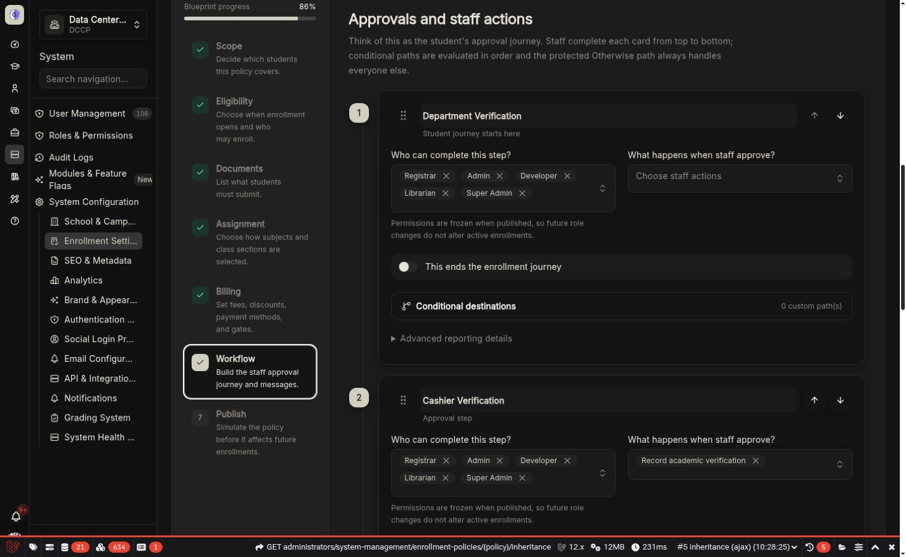

# KoAkademy

**Self-hosted school administration and learning platform** — enrollment workflows, student and faculty records, classes, schedules, grading, finance, and optional institutional modules in one application.

Built with **Laravel 12**, **Filament 5**, **Inertia**, and **React 19**. Ships as a single FrankenPHP (PHP 8.5) container image.

[](https://github.com/yukazakiri/koakademy/actions/workflows/ci.yml)
[](https://github.com/yukazakiri/koakademy/releases)
[](LICENSE.md)
[](https://yukazakiri.github.io/koakademy/)

> **Project status: production-capable beta.** KoAkademy has a documented production topology and automated tests, but operators should validate upgrades in staging, maintain backups, and review the security model for their institution. Only the latest stable release is supported.

## Highlights

- **Guided first-run setup** — a `/setup` wizard creates the institution and the first super administrator; no CLI user seeding required.
- **Full academic administration** — students, faculty, courses, classes, rooms, schedules/timetables with conflict detection, enrollment, and grading (point/percent scales, GWA rules) through a Filament admin panel.
- **Enrollment engine** — a verification pipeline (registrar → cashier) plus versioned enrollment **blueprints**: scoped, inheritable policies with simulation, staged rollout, and rollback.
- **Three React portals** — dedicated Inertia/React experiences for administrators, faculty (attendance, class posts, submissions, grading), and students (classes, schedule, tuition, digital ID).
- **Finance** — tuition assessment, cashier workflows with payment posting, statements of account with signed public verification, and finance reports.
- **Security built in** — role- and permission-aware access (30 roles via Filament Shield), TOTP and email-code MFA, WebAuthn passkeys, impersonation, and full activity logging.
- **Optional modules** — Inventory, Library, Cashier, Student Medical Records, Announcements, and a template-based Notification Center, all toggleable per institution.
- **Platform features** — Gotenberg-backed PDF generation (SOA, timetables, assessments), Excel exports, school-scoped multi-tenancy, 36 runtime feature flags (Laravel Pennant), PWA manifest, broadcasting, and a documented Sanctum API.

The API surface is beta. Only endpoints listed in the [API documentation](docs/src/content/docs/api/api-overview.mdx) are part of the documented public contract.

## Screenshots

<p align="center">
  
  
</p>

## Supported production topology

- KoAkademy application image (PHP 8.5 with FrankenPHP)
- PostgreSQL
- Redis for cache, sessions, and queues
- Gotenberg for `spatie/laravel-pdf`
- External S3-compatible object storage for uploads
- An operator-managed HTTPS edge such as Caddy, Nginx, Traefik, or a tunnel

`compose.production.yaml` publishes the application only on `127.0.0.1:8000`. PostgreSQL, Redis, and Gotenberg are not published to the host. The primary routing model uses one hostname with administration at `/admin`.

## Quick start

Requirements: Docker Engine with Compose v2, an HTTPS hostname, and an S3-compatible bucket.

```sh
cp .env.production.example .env
# Replace every change-me value and school.example in .env.

docker compose --env-file .env -f compose.production.yaml config --quiet
docker compose --env-file .env -f compose.production.yaml pull
docker compose --env-file .env -f compose.production.yaml up -d postgres redis gotenberg

docker compose --env-file .env -f compose.production.yaml run --rm app php artisan key:generate --show
# Put the generated value in APP_KEY, then run the explicit database upgrade.
docker compose --env-file .env -f compose.production.yaml run --rm app php artisan migrate --force
docker compose --env-file .env -f compose.production.yaml up -d app
```

Verify the private origin:

```sh
curl --fail --silent --show-error http://127.0.0.1:8000/up
```

Configure your HTTPS edge to proxy to `http://127.0.0.1:8000`, then open `https://school.example/setup`. The setup wizard creates the institution and first super administrator. Do not use `make:filament-user` for first-run installation.

See [Getting Started](GETTING_STARTED.md) and [Deployment](DEPLOYMENT.md) before exposing the service.

## Documentation

- [Getting started](GETTING_STARTED.md) — production installation
- [Deployment](DEPLOYMENT.md) — topology, upgrades, backups, rollback
- [Configuration](CONFIGURATION.md) — environment and service contract
- [Architecture](ARCHITECTURE.md) — runtime, layers, tenancy, queues
- [Operations and troubleshooting](TROUBLESHOOTING.md)
- [Native development](DEVELOPMENT.md)
- [FAQ](FAQ.md)
- [Changelog](CHANGELOG.md)
- [Hosted documentation](https://yukazakiri.github.io/koakademy/) — full Starlight site with user and portal guides

Root Markdown files are canonical for technical and project documentation. Marked MDX copies are generated for Astro and the in-app documentation; run `npm run docs:sync` after editing a canonical file.

## Contributing and security

Bug reports and pull requests are welcome; start with [CONTRIBUTING.md](CONTRIBUTING.md). Do not report suspected vulnerabilities in public issues — follow [SECURITY.md](SECURITY.md) and use GitHub Security Advisories.

## License

KoAkademy is licensed under [GNU AGPL-3.0-or-later](LICENSE.md). Network users must be offered the corresponding source code for the version they are using, including your modifications.
