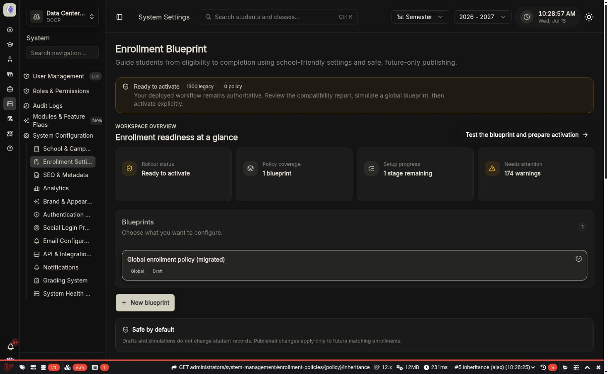

import { Card, CardGrid, Steps } from "@astrojs/starlight/components";

# Enrollment Policies

Enrollment Blueprints let a school administrator configure the full enrollment journey without editing code or JSON. A blueprint answers seven practical questions:

_The overview keeps rollout state, coverage, unfinished work, warnings, and the next action visible before editing._

1. Who does this apply to?
2. When can students start, and who is eligible?
3. Which documents are needed?
4. How are subjects and classes selected?
5. How are tuition and payment requirements calculated?
6. Who approves each step, and which messages are sent?
7. Has the finished journey been tested, published, and activated safely?

:::note[What this does]
The workspace turns administrator choices into a validated, versioned policy. New enrollments receive an immutable snapshot of the resolved policy, so later edits cannot silently change an active enrollment.
:::

<CardGrid>
    <Card title="Guided for first-time setup" icon="list-checks">
        Follow seven stages in order, with a progress rail, examples, recommendations, and contextual help.
    </Card>
    <Card title="Fast for returning administrators" icon="setting">
        Jump directly to any stage, override inherited values, test, and publish a focused change.
    </Card>
    <Card title="Safe for deployed schools" icon="shield-check">
        Legacy enrollment remains active until an authorized administrator explicitly activates the engine.
    </Card>
    <Card title="Extensible for open source" icon="puzzle">
        Community handlers use stable keys and optional operator metadata. Executable class names are never stored in policy files.
    </Card>
</CardGrid>

## The safety model

<Steps>
    1. **Draft** — edit freely. Drafts never affect live enrollments. 2. **Simulate** — test a representative student against every matching policy
    layer. Simulation performs no writes. 3. **Publish** — make an immutable version available for future matching enrollments. 4. **Activate** — opt
    future enrollments into the policy engine. This is separate from publication. 5. **Pin** — each new policy enrollment stores its compiled snapshot
    and continues with it permanently.
</Steps>

:::caution[Future versus existing enrollments]
Publishing, activation, deactivation, and rollback affect **future enrollments only**. Existing legacy enrollments stay legacy. Existing policy enrollments keep their original snapshot even if the rollout flag is later disabled.
:::

## Glossary

| Term               | Plain-language meaning                                                                                      |
| ------------------ | ----------------------------------------------------------------------------------------------------------- |
| Blueprint / policy | A named set of enrollment rules for a defined group of students.                                            |
| Scope              | The school, student type, program, school year, or semester the blueprint covers. Blank scope means global. |
| Inheritance        | Reusing settings from a broader published blueprint.                                                        |
| Override           | A deliberate local change that replaces an inherited value.                                                 |
| Draft              | The editable working version.                                                                               |
| Published version  | A permanent, validated version that can be selected for future enrollments.                                 |
| Snapshot           | The complete compiled policy pinned to one enrollment.                                                      |
| Simulation         | A no-write preview of eligibility, assignment, fees, workflow, messages, and blockers.                      |
| Legacy runtime     | The previously deployed enrollment logic and settings.                                                      |
| Policy runtime     | The versioned enrollment engine used after explicit activation.                                             |

## Common school scenarios

- A small school can publish one global blueprint and configure everything in one place.
- A multi-school installation can inherit a global blueprint and override only the school-specific documents or approval roles.
- College and TESDA can share a billing strategy while using different availability, programs, or workflow steps.
- A program can enforce prerequisites or unit limits without duplicating unrelated school-wide rules.

## Where to go next

- [Quick start: preset to activation](./quick-start/)
- [Scopes, inheritance, and overrides](./scopes-inheritance/)
- [Simulation, publication, activation, rollback, and backup](./simulation-publication/)
- [Maintainer extension reference](../development/enrollment-policy-extensions/)
