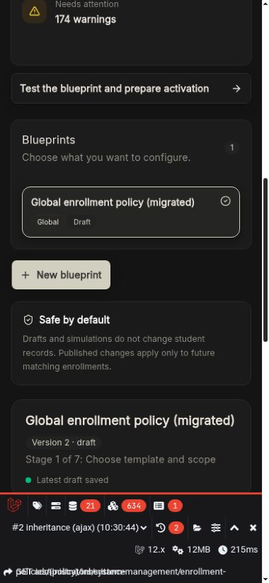

import { Steps } from "@astrojs/starlight/components";

# Quick start: preset to activation

Use this guide when configuring Enrollment Policies for the first time on a new or existing installation.

_The same guided workspace remains usable on smaller screens without exposing raw configuration._

:::caution[Deployed schools stay on legacy]
Creating, editing, simulating, or publishing a blueprint does not switch the live enrollment runtime. Activation is an explicit final decision and affects future enrollments only.
:::

## Before you begin

Confirm that you can manage System Management settings and that the school, programs, roles, payment methods, and academic periods already exist. Choose at least one representative student or realistic sample profile for simulation.

## Create the global blueprint

<Steps>
    1. Open **System Management → Enrollment Blueprint**. 2. Select **New blueprint**. 3. Enter a descriptive name such as `School-wide enrollment
    foundation`. 4. Choose a preset: - **Current legacy process** is safest when migrating an established school. - **Registrar and cashier approval**
    provides a common two-approval starting point. - **Manual enrollment** keeps assignment decisions with staff. - **Automatic curriculum
    assignment** recommends or assigns curriculum subjects. - **No-payment enrollment** removes the minimum-payment gate. 5. Leave all scope fields
    blank. The coverage preview should say this is the global blueprint. 6. Select **Create guided draft**.
</Steps>

:::note[What this does]
The global blueprint becomes the stable foundation for every scoped blueprint. A scoped policy cannot inherit until a global version is published.
:::

## Complete the seven stages

### 1. Template and scope

Confirm the coverage sentence and review inherited layers. A global blueprint has no ancestor. Downloading a backup is optional at this stage.

### 2. Availability and eligibility

Start with conservative defaults:

- Allow only enrollment channels the school actively supports.
- Set an opening and closing date if the period is time-limited.
- Keep duplicate-enrollment protection enabled.
- Select allowed schools, programs, student types, periods, and year levels only when restriction is intended.
- Add balance, prerequisite, clearance, capacity, or schedule checks that the school can reliably supply.

### 3. Required documents

Use student-facing names and instructions. For example: **Form 138** with “Upload a clear PDF of every page; the registrar will request the original later.” Mark an item required only if its absence should block progress.

### 4. Subjects and classes

Choose manual assignment for the safest first rollout. Use automatic curriculum or first-available class assignment only after the curriculum and class capacities are accurate.

### 5. Tuition and payment

Confirm the course-rate strategy, discounts, additional fees, accepted payment methods, and minimum-payment rule. Use **No minimum** if payment should not block completion.

### 6. Approvals and notifications

Review every workflow card from top to bottom:

- Give each step a plain staff-facing name.
- Select responsible roles.
- Select only the actions that should occur on approval.
- Make exactly one step the final completed outcome.
- Keep the protected **Otherwise** destination pointing forward.
- Add messages only where students or staff need an update.

### 7. Test, publish, and activate

Save the draft, describe a representative student, and run the journey. Fix every blocker using its **Review setting** link. Add a change note and publish only when the readiness checklist is complete.

## Activate safely

After the global policy is published and the compatibility report says **Ready to activate**:

1. Run one final representative simulation against the active global version.
2. Select **Activate for future enrollments**.
3. Read the impact dialog carefully.
4. Confirm activation.
5. Create a test enrollment through each supported entry path and verify the pinned workflow object.

:::tip[Recommended rollout]
Start with a policy that mirrors the current legacy process. After a stable rollout, publish focused improvements one version at a time.
:::

## Next steps

- [Create scoped overrides](./scopes-inheritance/)
- [Understand the simulation report](./simulation-publication/)
- [Use the deployment-safety checklist](./troubleshooting-deployment/)
