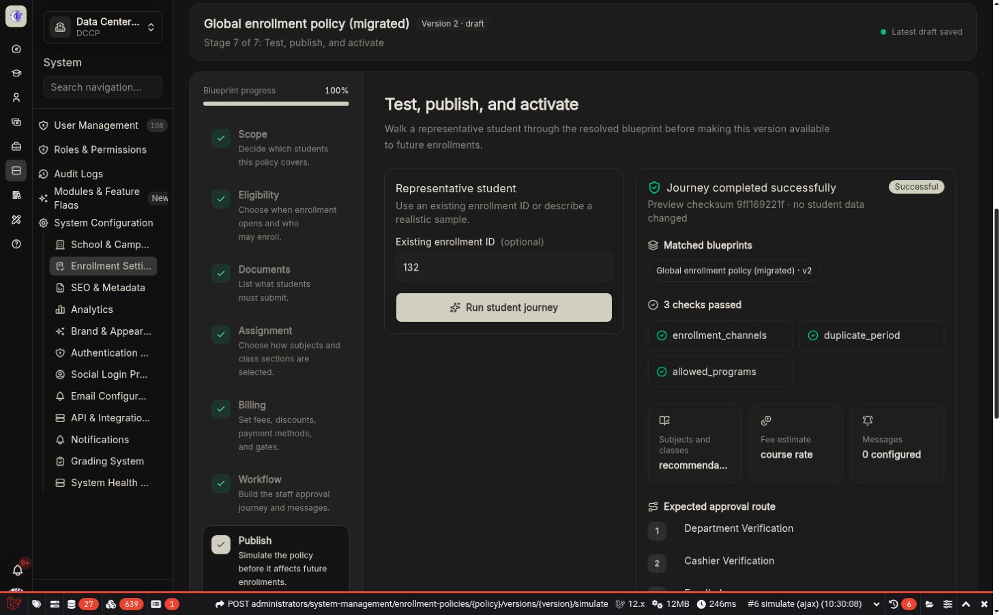

# Simulation, publication, activation, rollback, and backup

The last stage separates four different operations so an administrator always knows what changes live behavior.

_A successful journey names every matched policy and confirms that no student data was changed._

## Simulation

Choose an existing enrollment ID or describe a representative sample student. The server resolves every matching policy layer while substituting the current saved draft at its scope.

The visual journey reports:

- Matched blueprint names, scopes, and versions
- Source provenance
- Checks that passed
- Blockers with **Review setting** links
- Selected subject and class strategy
- Fee estimate and payment gate
- Expected approval route
- Notifications
- A deterministic checksum

:::note[What this does]
Simulation performs no writes. The same deterministic publication candidate is used for simulation and publishing, including generated workflow permission names. If the saved draft changes, run simulation again.
:::

## Publication readiness

The publish action requires:

- All draft changes saved
- Full validation completed
- A successful representative simulation with no blockers
- A meaningful change note
- The exact simulated checksum

A published version is immutable. Editing a published policy creates a new draft.

## Activation

Activation controls which runtime **future enrollments** receive:

- Flag off: new enrollments remain legacy.
- Flag on: new enrollments use the active compiled policy.
- Existing policy enrollments continue through their pinned snapshot even after deactivation.

Activation requires an active published global blueprint, a successful compatibility report, full validation, and representative simulation.

## Rollback

Rollback selects an older immutable published version for future matching enrollments. It does not rewrite the current version, snapshots, statuses, events, or existing enrollments.

## Backup export

Use **Download backup** to export schema-versioned configuration. The file contains stable handler keys and data only—never PHP class names, scripts, closures, or arbitrary formulas.

## Backup import

Import is under Advanced:

1. Choose a trusted KoAkademy JSON backup.
2. Review the human-readable count of checks, documents, and workflow steps.
3. Import it as a new draft.
4. Review every guided section.
5. Save, simulate, and publish normally.

Unknown handlers, unsupported schema versions, executable classes, scripts, code fields, arbitrary URLs, and unapproved option sources are rejected.

:::caution[Backups are not a bypass]
An imported file never activates itself and never bypasses validation. Extensions without visual metadata remain read-only but executable only when their stable keys are registered.
:::

## Recommended simulation set

- A typical passing student
- A student blocked by one academic requirement
- A student with an outstanding balance
- A student at class capacity
- A student matching the most specific combined scope
- Each public, administrator, continuing, and API channel the school supports
