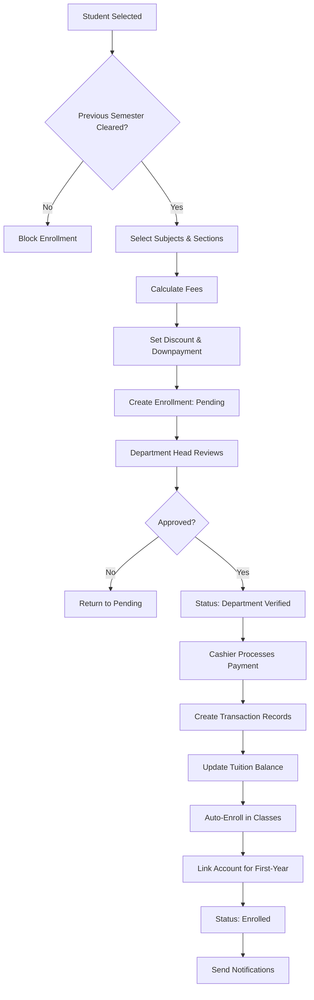
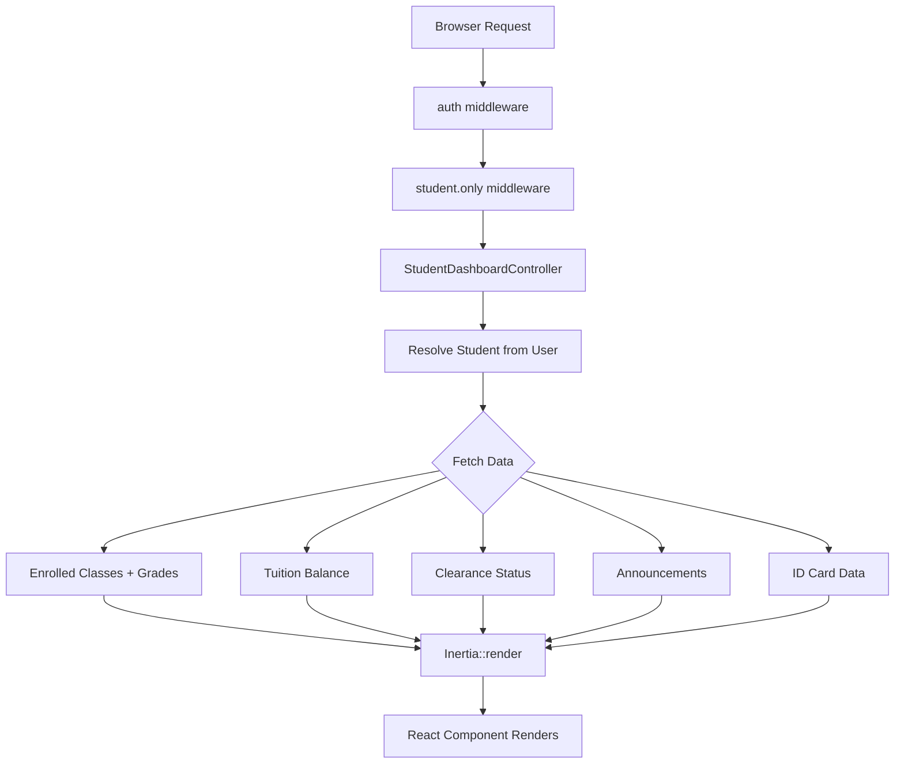

import { Aside } from '@astrojs/starlight/components';

> **Framework**: Laravel 12 + Filament 4 + Inertia.js v2 + React 19  
> **Database**: SQLite (development), configurable for production  
> **Date of analysis**: 2026-05-31

---

## Repository Overview

Koakademy is a full-featured **school management system** for colleges and senior high schools in the Philippines. It supports the complete student lifecycle from applicant registration through enrollment, class management, grading, tuition payments, clearance, and graduation tracking.

### Key Architectural Layers

| Layer | Technology | Location |
|---|---|---|
| Admin panel | Filament 4 (Livewire-based) | `app/Filament/` |
| Student portal | Inertia.js + React 19 | `resources/js/`, routes in `routes/web/student.php` |
| Faculty portal | Inertia.js + React 19 | `resources/js/`, routes in `routes/web/faculty.php` |
| Public pages | Inertia.js + React 19 | `resources/js/`, routes in `routes/web.php` |
| Background jobs | Laravel Queues | `app/Jobs/` |
| Modules | nwidart/laravel-modules | `Modules/` |
| API | Laravel REST | `routes/api.php` |

### Relevant Directories

```
app/
├── Models/            # Student, StudentEnrollment, StudentTuition, etc.
├── Filament/Resources/Students/    # Filament admin CRUD for students
├── Filament/Resources/StudentEnrollments/  # Filament admin CRUD for enrollments
├── Filament/Pages/     # ManageStudentClearances, Cashier (via module)
├── Http/Controllers/   # StudentDashboardController, StudentClassController, etc.
├── Services/           # EnrollmentService, StudentService, DigitalIdCardService, etc.
├── Jobs/               # ExportStudentDataJob, MoveStudentToSectionJob, etc.
├── Exports/            # StudentListExport, EnrollmentReportExport
├── Notifications/      # EnrollmentVerified, MigrateToStudent, etc.
├── Rules/              # PreviousSemesterCleared, ScheduleOverlapRule
├── Policies/           # StudentPolicy, StudentEnrollmentPolicy, etc.
├── Enums/              # StudentStatus, StudentType, ClearanceStatus, etc.

Modules/
├── StudentMedicalRecords/  # Medical records module
├── Cashier/                # Cashier payment page
├── Announcement/           # Announcement system (targets "student" audience)

resources/js/
├── Components/dashboard/   # Student portal widgets
├── Components/class/       # Classroom components
└── Components/administrators/  # Admin UI components
```

---

## Student Domain Map

### Core Entity: `Student` (`app/Models/Student.php`)

The central model (~1,669 lines). Uses `SoftDeletes`, `Searchable` (Scout), `Versionable` (snapshot strategy), `LogsActivity`, `Notifiable`.

**Identity & demographics (30+ fields):**
- `id` (auto-generated integer, non-incrementing)
- `student_id` (display ID, 6-digit with type prefix, e.g., "2-001234")
- `lrn` (Learner Reference Number, 12-digit, for SHS students)
- `student_type` → `StudentType` enum (College, SeniorHighSchool, TESDA, DHRT)
- `first_name`, `last_name`, `middle_name`, `suffix`, `gender`, `birth_date`, `age`
- `email`, `phone`, `civil_status`, `nationality`, `religion`
- `address`, `ethnicity`, `city_of_origin`, `province_of_origin`, `region_of_origin`

**Academic:**
- `course_id` → `Course` relationship
- `academic_year` (1st–4th Year or Grade 11–12)
- `shs_strand_id`, `shs_track_id` (SHS only)
- `status` → `StudentStatus` enum (Applicant, Enrolled, OnLeave, Withdrawn, Dropped, Graduated, Transferred)

**Flags & special groups:**
- `is_indigenous_person`, `indigenous_group`, `is_pwd`, `pwd_type`
- `is_solo_parent`, `is_senior_citizen`, `is_magna_carta`, `is_underprivileged`
- `is_first_generation`, `family_income_bracket`

**Scholarship & employment:**
- `scholarship_type` → `ScholarshipType` enum
- `employment_status` → `EmploymentStatus` enum
- `employer_name`, `job_position`, `employment_date`, `employed_by_institution`

**Withdrawal/attrition:**
- `withdrawal_date`, `withdrawal_reason`, `attrition_category` → `AttritionCategory` enum, `dropout_date`

**Key relationships:**
- `clearances()` → `hasMany` `StudentClearance`
- `classEnrollments()` → `hasMany` `ClassEnrollment`
- `subjectEnrolled()` → `hasMany` `SubjectEnrollment`
- `StudentTuition()` → `hasMany` `StudentTuition`
- `account()` → `hasOne` `Account` (via polymorphic `person_id`/`person_type`)
- `medicalRecords()` → `hasMany` `MedicalRecord` (from StudentMedicalRecords module)

### Supporting Models

| Model | Table | Purpose |
|---|---|---|
| `StudentEnrollment` | `student_enrollment` | Per-semester enrollment record (student → course) |
| `StudentTuition` | `student_tuition` | Tuition fee breakdown per enrollment |
| `StudentTransaction` | `student_transactions` | Pivot: student ↔ transaction |
| `StudentClearance` | `student_clearances` | Per-semester clearance status |
| `StudentContact` | `student_contacts` | Contact details & emergency contacts |
| `StudentParentsInfo` | `student_parents_info` | Parent/guardian information |
| `StudentEducationInfo` | `student_education_info` | Previous school history |
| `StudentsPersonalInfo` | `students_personal_info` | Birthplace, civil status, physical attributes |
| `ClassEnrollment` | `class_enrollments` | Student enrolled in a class, with grades |
| `ClassAttendanceRecord` | — | Individual attendance entry per session |
| `ClassAttendanceSession` | — | An attendance-taking session for a class |
| `SubjectEnrollment` | `subject_enrollment` | Subject-level enrollment |
| `PendingEnrollment` | `pending_enrollments` | Applicant data submitted via public form |
| `StudentStatusRecord` | `student_statuses` | Historical status changes |
| `StudentIdChangeLog` | — | Audit log for student ID changes |
| `AdditionalFee` | — | Extra charges on an enrollment |

### Student Status Lifecycle

```
Applicant ──→ Enrolled ──→ Graduated
                │
                ├──→ OnLeave (may return to Enrolled)
                ├──→ Withdrawn
                ├──→ Dropped
                └──→ Transferred
```

Status changes are audited via `StudentStatusRecord`.

---

## Feature Inventory

### Student Profile & CRUD

- **Create student**: Filament `CreateStudent` page + `StudentService::createStudent()`
- **Edit student**: `EditStudent` page, form with 6 tabbed sections
- **View student**: `ViewStudent` page with comprehensive infolist
- **List/search/filter**: `ListStudents` with 10+ filters
- **Delete/restore/force delete**: Soft deletes supported
- **Student revisions**: Version history via `StudentRevisions` page
- **Global search**: By student_id, first_name, last_name

### Enrollment Pipeline

Three-step configurable workflow managed by `EnrollmentPipelineService`:

```
Step 1: Pending        → Student submits enrollment (subjects, fees, downpayment)
Step 2: Dept Verified  → Department head reviews & approves
Step 3: Cashier ✅      → Cashier processes payment → "Enrolled"
```

Supports custom intermediate steps, Quick Enroll (super_admin bypass), undo operations, and assessment PDF generation.

### Class Management

- Class enrollment (manual or auto-enrollment via `autoEnrollInClasses()`)
- Class roster (Filament relations + Inertia detail page)
- Move student between sections (single via `MoveStudentToSectionJob`, bulk via `BulkMoveStudentsToSectionJob`)
- Student class timetable (visual grid + PDF export)
- Student list export (Excel via `StudentListExport`)

### Grading

- Grade entry: prelim, midterm, finals, total_average on `ClassEnrollment`
- Grade finalization & verification (with verifier tracking)
- Grade viewing: student portal dashboard + class detail + infolist
- Grade submission: **stub** — `GradeSubmissionController` has empty methods

### Attendance

- Create attendance session per class
- Record per-student status: present, late, absent, excused
- Lock/unlock sessions, "no meeting" support
- Attendance reports (PDF via `GenerateAttendancePdfJob`)

### Tuition & Payments

- Fee calculation: lecture + lab + miscellaneous + additional − discount
- Payment tracking with JSON `settlements` breakdown
- Payment progress percentage, SOA PDF generation
- Cashier page (Filament: `Modules/Cashier/app/Filament/Pages/Cashier.php`)
- Ad-hoc transactions, invoice/OR generation (10-digit numbers)

### Clearance System

- Per-semester clearance: Cleared / Not Cleared / Pending / Conditional
- `PreviousSemesterCleared` validation rule blocks enrollment if not cleared
- Bulk clearance management via `ManageStudentClearances` page
- Quick clear actions from student view and enrollment form

### Documents

- Fixed types: Birth Certificate, Form 138, Form 137, Good Moral, Transfer Credentials, Transcript, 1×1 Picture
- Dynamic/resource documents, 5MB limit
- `AdministratorStudentDocumentController` for admin management

### Medical Records (Module: `StudentMedicalRecords`)

- 11 record types: Checkup, Vaccination, Allergy, Medication, Emergency, Dental, Vision, Mental Health, Laboratory, Surgery, Follow-Up
- Vitals tracking: height, weight, BMI (auto-calculated), blood pressure, temperature, heart rate
- Priority: Low/Normal/High/Urgent; Status: Active/Resolved/Ongoing/Cancelled
- Confidential flag, Filament CRUD with stats widget
- Unit tests only (no feature tests, API controllers are stubs)

### Digital ID Cards

- QR-code-based with encrypted verification tokens (`DigitalIdCardService`)
- Public verification endpoint (`/id-card/verify/{token}`) — no auth required
- Student cards: photo, name, course, year level, status, QR code

### Student Portal (Inertia/React SPA)

| Route | Page | Features |
|---|---|---|
| `/student/dashboard` | Dashboard | ID card, classes, grades, tuition, clearance, announcements |
| `/student/classes` | My Classes | Curriculum checklist, current classes, progress |
| `/student/classes/{class}` | Class Detail | Posts, assignments, grades, attendance, classmates |
| `/student/schedule` | Schedule | Weekly timetable grid |
| `/student/tuition` | Tuition | Balance, payment history, SOA |
| `/student/tuition/soa` | SOA | Printable billing statement |
| `/student/id-card/view` | ID Card | Full digital ID card view |
| `/student/profile` | Profile | Edit info, password, 2FA, passkeys, API keys |
| `/student/search` | Search | Search subjects, classes, courses, enrollments |

### Public Enrollment

- Guest form (`/enrollment`) — no auth required
- Applicant data: demographics, education history, parent info, documents
- Duplicate detection: email + name + birth date
- Feature-gated: `OnlineCollegeEnrollment`, `OnlineTesdaEnrollment`

### Exports & Reports

- Student data export (CSV/PDF via `ExportStudentDataJob`)
- Enrollment report (Excel via `EnrollmentReportExport`, PDF preview)
- Class roster export (Excel via `StudentListExport`)
- Bulk assessment PDFs (multi-job pipeline: chunk → merge)
- Timetable, student list, attendance, and SOA PDFs via background jobs

### Bulk Operations

- Bulk status update, clearance management, email, section transfer, delete/restore/force delete

### SHS (Senior High School) Support

- `ShsStudent` model, strand/track selection (`ShsStrand`, `ShsTrack`)
- Grade 11/12 academic year options, LRN tracking
- Separate Filament cluster: `Clusters/SeniorHighSchool/Resources/ShsStudents/`

---

## Implementation Walkthroughs

### Student Creation Flow

```
1. Admin opens Filament CreateStudent page
2. StudentForm schema renders form
3. On submit → StudentService::createStudent($data)
   a. Resolves StudentType from input
   b. Student::generateNextId($type) → 6-digit ID
   c. Calculates age from birth_date
   d. Creates Student record
   e. StudentClearance::createForCurrentSemester($student)
   f. Notifies super_admin users
4. Student boot::creating auto-generates `id` (max+1)
5. Student boot::saving auto-saves related models (contact, parent, education, personal, document)
6. For SHS: boot::created syncs to ShsStudent
```

### Enrollment Flow

```
1. Select student → PreviousSemesterCleared rule validates clearance
2. Select subjects via repeater → live fee calculation
   (lecture units × rate, lab units × rate, NSTP 50% discount, modular flat rate ₱2,400)
3. Set discount, downpayment → overall_tuition = lectures + lab + misc + additional − discount
4. Enrollment created with status = Entry step from EnrollmentPipelineService
5. Department Head advances to "Department Verified"
6. Cashier calls EnrollmentService::verifyByCashier():
   a. Creates Transaction with settlements JSON
   b. Creates AdditionalFee transactions if marked separate
   c. Links via StudentTransaction, AdminTransaction
   d. Updates StudentTuition balance
   e. Auto-enrolls student in classes
   f. Links Account for first-year students
   g. Sends notifications
7. Student is now "Enrolled"
```

### Student Portal Dashboard Flow

```
1. GET /student/dashboard → StudentDashboardController (auth + student.only middleware)
2. Controller resolves Student from authenticated User (by email or user_id)
3. Fetches: enrolled classes + grades, tuition balance, clearance status,
   announcements (AnnouncementDataService), ID card data (DigitalIdCardService)
4. Returns Inertia::render('student/dashboard', [...])
5. React component renders dashboard widgets
```

---

## Role & Permission Behavior

### Role System

Managed via Spatie/laravel-permission + Filament Shield:

| Role | Access Level |
|---|---|
| `super_admin` | Full access, bypasses all permission checks |
| `admin` / `administrator` | Student CRUD, enrollment, classes, reports |
| `registrar` | Student records, enrollment workflow |
| `faculty` | Class management, grading, attendance, student info lookup |
| `student` | Portal: own dashboard, classes, grades, tuition, schedule, profile |
| `cashier` | Payment processing, tuition management |
| `department_head` | Department-level enrollment verification |
| `student_services` | Student support features |

### Permission Model

All Filament resources use Spatie Shield permission strings:
- `ViewAny:Student`, `View:Student`, `Create:Student`, `Update:Student`, `Delete:Student`, `Restore:Student`, `ForceDelete:Student`

Policies check `$authUser->can('PermissionName:Model')`. `super_admin` bypasses all checks.

### Student Portal Access

Middleware `student.only` checks:
- User has `student` role in `UserRole` enum
- Or user has linked `Student` record

---

## Configuration & Setup

### Environment Variables

| Variable | Purpose |
|---|---|
| `FEATURE_ONLINE_COLLEGE_ENROLLMENT` | Toggle public enrollment form |
| `FEATURE_ONLINE_TESDA_ENROLLMENT` | Toggle TESDA enrollment |
| `FEATURE_ENABLE_SIGNATURES` | Toggle digital signature collection |

### Database Migrations

Key migrations: `create_students_table`, `create_student_contacts_table`, `create_student_parents_info_table`, `create_student_education_info_table`, `create_students_personal_info_table`, `create_student_enrollment_table`, `create_student_tuition_table`, `create_student_transactions_table`, `create_transactions_table`, `create_student_clearances_table`, `create_class_enrollments_table`, `create_subject_enrollment_table`, and the Medical Records module migration.

### Seed Data

| Seeder | What It Creates |
|---|---|
| `StudentSeeder` | 50 students with Filipino names, mixed statuses |
| `StudentEnrollmentSeeder` | ~9 enrollment records across levels 1–4 |
| `StudentEnrollmentCurrentSemesterSeeder` | 30 current-semester enrollments |
| `StudentTuitionSeeder` | Tuition records with varied payment statuses |
| `ClassEnrollmentSeeder` | Auto-enrolled students in classes with grades |
| `StudentClearanceSeeder` | Mixed clearance scenarios |
| `StudentRelatedTablesSeeder` | Sample contacts, parents, education, documents |

### Required Integrations

- **Laravel Scout**: Full-text search for students, classes, courses
- **Laravel Horizon**: Queue monitoring for background jobs
- **endroid/qr-code**: QR code generation for digital ID cards
- **Spatie/laravel-permission + Filament Shield**: Role/permission management
- **Overtrue/laravel-versionable**: Student record versioning
- **Spatie/laravel-activitylog**: Audit logging
- **PDF generation**: Browsershot or Snappy

---

## Known Limitations & Risks

### Incomplete Features

| Feature | Status | Impact |
|---|---|---|
| `GradeSubmissionController` | **All methods empty** (stub) | Grade submission workflow not implemented |
| Medical Records API | **Controller stubs** — `store()`, `update()`, `destroy()` are empty | API routes non-functional |
| SHS Student sync | Only `creating`/`updated` hooks; no `deleting` sync | Orphaned ShsStudent records possible |

### Security & Privacy

- **Medical Records confidentiality**: The `is_confidential` flag is not enforced by the `MedicalRecordPolicy`. Any user with `View:MedicalRecord` can see all records.
- **Medical Records foreign keys**: Present in migration but commented out ("for testing") — no referential integrity at DB level.
- **No row-level security**: A user with `View:Student` can see all students across all schools.

### Data Integrity

- **Dual ID system**: `Student.id` (DB primary key, auto-generated via `max('id') + 1`) vs `student_id` (display ID). Race condition possible under high concurrency.
- **Student `saving` hook**: Auto-saves related models on every save, could cause unexpected data overwrites.
- **Student model size**: ~1,669 lines, 73 fillable fields — could benefit from decomposition.

### Missing Test Coverage

- No feature tests for Medical Records module (only unit tests)
- No browser tests for student portal
- No API tests for student-related endpoints
- `GradeSubmissionController` has no tests (controller is a stub)

---

## File Reference Index

### Core Models

| File | Purpose |
|---|---|
| `app/Models/Student.php` | Central student model (~1,669 lines) |
| `app/Models/StudentEnrollment.php` | Per-semester enrollment |
| `app/Models/StudentTuition.php` | Tuition breakdown |
| `app/Models/StudentTransaction.php` | Payment pivot |
| `app/Models/StudentClearance.php` | Clearance status |
| `app/Models/StudentContact.php` | Contact/emergency info |
| `app/Models/StudentParentsInfo.php` | Parent/guardian |
| `app/Models/StudentEducationInfo.php` | School history |
| `app/Models/StudentsPersonalInfo.php` | Personal details |
| `app/Models/ClassEnrollment.php` | Class enrollment + grades |
| `app/Models/ClassAttendanceRecord.php` | Attendance entry |
| `app/Models/ClassAttendanceSession.php` | Attendance session |
| `app/Models/SubjectEnrollment.php` | Subject enrollment |
| `app/Models/PendingEnrollment.php` | Guest applicant data |
| `app/Models/StudentStatusRecord.php` | Status change history |
| `app/Models/StudentIdChangeLog.php` | ID change audit |
| `app/Models/AdditionalFee.php` | Extra enrollment fees |
| `app/Models/Course.php` | Academic program |
| `app/Models/Classes.php` | Class/section |
| `app/Models/Faculty.php` | Faculty member |
| `app/Models/User.php` | User account |

### Filament Admin Resources

| File | Purpose |
|---|---|
| `app/Filament/Resources/Students/StudentResource.php` | Student CRUD resource |
| `app/Filament/Resources/Students/Pages/CreateStudent.php` | Create page |
| `app/Filament/Resources/Students/Pages/EditStudent.php` | Edit page |
| `app/Filament/Resources/Students/Pages/ListStudents.php` | List page |
| `app/Filament/Resources/Students/Pages/ViewStudent.php` | View page |
| `app/Filament/Resources/Students/Pages/ChangeCourse.php` | Course change page |
| `app/Filament/Resources/Students/Pages/StudentRevisions.php` | Version history |
| `app/Filament/Resources/Students/Schemas/StudentForm.php` | Form schema |
| `app/Filament/Resources/Students/Schemas/StudentInfolist.php` | Infolist schema |
| `app/Filament/Resources/Students/Tables/StudentsTable.php` | Table schema |
| `app/Filament/Resources/Students/Actions/ChangeCourseAction.php` | Course change action |
| `app/Filament/Resources/StudentEnrollments/StudentEnrollmentResource.php` | Enrollment CRUD |
| `app/Filament/Pages/ManageStudentClearances.php` | Clearance management |
| `app/Filament/Exports/StudentsExporter.php` | Student export |
| `app/Filament/Exports/StudentEnrollmentExporter.php` | Enrollment export |

### Controllers

| File | Purpose |
|---|---|
| `app/Http/Controllers/AdministratorStudentManagementController.php` | Admin student CRUD (57 methods) |
| `app/Http/Controllers/AdministratorEnrollmentManagementController.php` | Admin enrollment CRUD + pipeline |
| `app/Http/Controllers/AdministratorStudentDocumentController.php` | Document upload/management |
| `app/Http/Controllers/AdministratorClassManagementController.php` | Class management |
| `app/Http/Controllers/AdministratorCurriculumManagementController.php` | Curriculum/program management |
| `app/Http/Controllers/StudentDashboardController.php` | Student portal dashboard |
| `app/Http/Controllers/StudentClassesController.php` | Student class listing |
| `app/Http/Controllers/StudentClassController.php` | Student class detail + submissions |
| `app/Http/Controllers/StudentScheduleController.php` | Student timetable |
| `app/Http/Controllers/StudentTuitionController.php` | Student tuition/SOA |
| `app/Http/Controllers/StudentGlobalSearchController.php` | Student portal search |
| `app/Http/Controllers/StudentInfoController.php` | Faculty student lookup |
| `app/Http/Controllers/EnrollmentRegistrationController.php` | Public enrollment form |
| `app/Http/Controllers/DigitalIdCardController.php` | ID card generation/verification |
| `app/Http/Controllers/GradeSubmissionController.php` | **STUB** — not implemented |

### Services

| File | Purpose |
|---|---|
| `app/Services/StudentService.php` | Student creation with clearance |
| `app/Services/EnrollmentService.php` | Enrollment creation, verification, tuition calculation |
| `app/Services/EnrollmentPipelineService.php` | Configurable enrollment workflow engine (~1,011 lines) |
| `app/Services/DigitalIdCardService.php` | QR-code ID card generation & verification |
| `app/Services/StudentSectionTransferService.php` | Section transfer logic |
| `app/Services/StudentTransferEmailService.php` | Transfer notification emails |
| `app/Services/StudentReportingService.php` | Filtered data for exports |
| `app/Services/StudentClassShareService.php` | Class data for student portal |
| `app/Services/StudentIdUpdateService.php` | Student ID change logic |
| `app/Services/StudentTimetablePdfService.php` | Timetable PDF generation |
| `app/Services/GradingSystemService.php` | Grade computation |
| `app/Services/GeneralSettingsService.php` | School year, semester, misc settings |
| `app/Services/PdfGenerationService.php` | Shared PDF utilities |

### Background Jobs

| File | Purpose |
|---|---|
| `app/Jobs/ExportStudentDataJob.php` | Async student data export |
| `app/Jobs/MoveStudentToSectionJob.php` | Single student section transfer |
| `app/Jobs/BulkMoveStudentsToSectionJob.php` | Batch section transfer |
| `app/Jobs/GenerateAssessmentPdfJob.php` | Single assessment PDF |
| `app/Jobs/GenerateBulkAssessmentsJob.php` | Bulk assessment orchestrator |
| `app/Jobs/GenerateStudentTimetablePdfJob.php` | Student timetable PDF |
| `app/Jobs/GenerateStudentSoaPdfJob.php` | Statement of Account PDF |
| `app/Jobs/GenerateStudentListPdfJob.php` | Class roster PDF |
| `app/Jobs/GenerateAttendancePdfJob.php` | Attendance report PDF |
| `app/Jobs/SendAssessmentNotificationJob.php` | Assessment delivery notification |
| `app/Jobs/SendEventReminder.php` | Event reminders |

### Modules

| Path | Purpose |
|---|---|
| `Modules/StudentMedicalRecords/` | Medical records (Filament CRUD + unit tests) |
| `Modules/Cashier/` | Cashier payment page |
| `Modules/Announcement/` | Announcements (targets "student" audience) |

### Routes

| File | Purpose |
|---|---|
| `routes/web/student.php` | Student portal routes (~45 endpoints) |
| `routes/web/faculty.php` | Faculty portal routes |
| `routes/web.php` | Public + admin routes |
| `routes/api.php` | API routes |

### Tests

| File | Type |
|---|---|
| `tests/Unit/StudentEnrollmentModelTest.php` | Unit |
| `tests/Unit/StudentTuitionTest.php` | Unit |
| `tests/Unit/StudentClassShareServiceTest.php` | Unit |
| `tests/Unit/StudentIdUpdateServiceJsonFixTest.php` | Unit |
| `tests/Unit/EnrollmentPipelineServiceTest.php` | Unit |
| `tests/Feature/StudentProfileUpdateTest.php` | Feature |
| `tests/Feature/StudentClassesTest.php` | Feature |
| `tests/Feature/StudentScheduleTest.php` | Feature |
| `tests/Feature/StudentClearanceValidationTest.php` | Feature |
| `tests/Feature/DigitalIdCardTest.php` | Feature |
| `tests/Feature/AdministratorStudentCreateTest.php` | Feature |
| `tests/Feature/AdministratorStudentBulkActionsTest.php` | Feature |
| `tests/Feature/OnlineEnrollmentFeatureTest.php` | Feature |
| `Modules/StudentMedicalRecords/tests/Unit/MedicalRecordTest.php` | Unit |

### Enums

| File | Values |
|---|---|
| `app/Enums/StudentStatus.php` | Applicant, Enrolled, OnLeave, Withdrawn, Dropped, Graduated, Transferred |
| `app/Enums/StudentType.php` | College, SeniorHighSchool, TESDA, DHRT |
| `app/Enums/ClearanceStatus.php` | Cleared, NotCleared, Pending, Conditional |
| `app/Enums/EnrollStat.php` | Pending, VerifiedByDeptHead, VerifiedByCashier, Enrolled |
| `app/Enums/AttritionCategory.php` | Academic, Financial, Personal, Transfer, Relocation, Other |
| `app/Enums/ScholarshipType.php` | Various scholarship types |
| `app/Enums/EmploymentStatus.php` | Employment statuses |
| `app/Enums/StudentData.php` | Utility: Filipino name/address generators |

---

## Data Flow Diagrams

### Enrollment Pipeline



### Student Portal Request Flow


